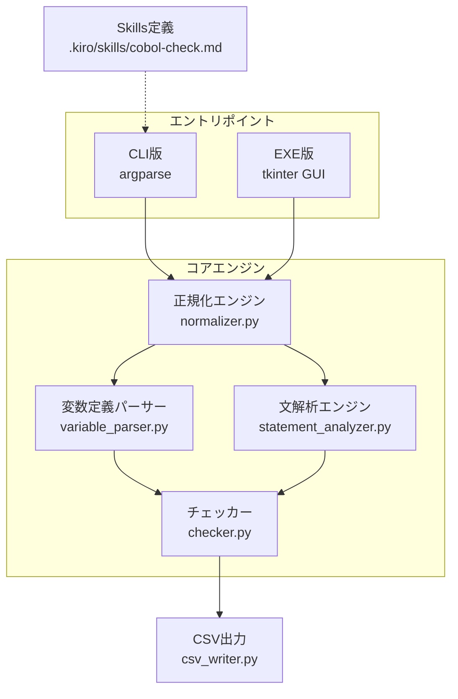
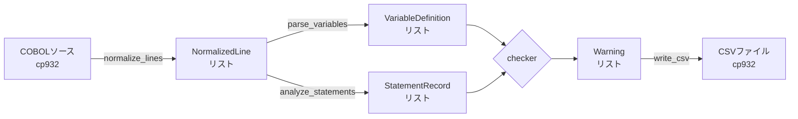

# 設計ドキュメント: COBOL静的チェッカー

## 概要

本設計は、COBOLソースコードの静的解析を行い、VALUE値上書き（Override）と未初期化変数参照（Uninitialized）の2種類の警告を検出するPythonスクリプト、AWS Kiro Skills定義、およびEXEバイナリの3つの成果物を定義する。

システムは以下のパイプライン構成で動作する:

```
COBOLソース → 正規化エンジン → 変数定義パーサー → 文解析エンジン → チェッカー → CSV出力
```

主要な設計判断:
- パイプライン型アーキテクチャにより各モジュールを独立してテスト可能にする
- 正規化エンジンを最前段に配置し、後続モジュールはCOBOL固定形式の複雑さを意識しない
- CLI版とEXE版でチェックロジックを完全に共有し、エントリポイントのみ分離する

## アーキテクチャ



### モジュール構成

```
cobol_static_checker/
├── __init__.py
├── normalizer.py          # 正規化エンジン
├── variable_parser.py     # 変数定義パーサー
├── statement_analyzer.py  # 文解析エンジン
├── checker.py             # チェックロジック（Override/Uninitialized）
├── csv_writer.py          # CSV出力
├── cli.py                 # CLIエントリポイント
└── gui.py                 # EXE用GUIエントリポイント
.kiro/skills/cobol-check.md  # Skills定義
build_exe.py               # PyInstallerビルドスクリプト
```

### 設計判断

1. **単一パッケージ構成**: `cobol_static_checker` パッケージに全モジュールを配置。サブパッケージは不要な複雑さを避けるため使用しない
2. **エントリポイント分離**: `cli.py` と `gui.py` を分離し、コアロジックはどちらからも呼び出し可能にする
3. **正規化の前段配置**: 後続モジュールは正規化済みの論理行のみを扱い、72カラム制限や継続行を意識しない

## コンポーネントとインターフェース

### 1. 正規化エンジン（normalizer.py）

COBOLソースファイルを読み込み、固定形式の前処理を行う。

```python
def normalize_lines(file_path: str, encoding: str = "cp932") -> list[NormalizedLine]:
    """
    COBOLソースファイルを正規化し、論理行のリストを返す。
    
    処理:
    1. ファイルをcp932で読み込み
    2. 各行を72カラムで切り詰め
    3. 7カラム目のインジケータを判定
    4. コメント行（*, /, D, d）を除外
    5. 継続行（-）を直前の行と結合
    6. 7カラム目以降の内容を抽出
    """
    ...
```

### 2. 変数定義パーサー（variable_parser.py）

WORKING-STORAGE SECTIONの変数定義を解析する。

```python
def parse_variables(lines: list[NormalizedLine]) -> list[VariableDefinition]:
    """
    正規化済み論理行からWORKING-STORAGE SECTIONの変数定義を解析する。
    
    処理:
    1. WORKING-STORAGE SECTIONの開始・終了を検出
    2. レベル番号、変数名、VALUE句、PIC句、COPY句を解析
    3. グループ項目の親子関係を構築
    4. 全角文字を含む識別子を認識
    """
    ...
```

### 3. 文解析エンジン（statement_analyzer.py）

PROCEDURE DIVISIONの各文を解析し、変数の代入・参照関係を記録する。

```python
def analyze_statements(lines: list[NormalizedLine]) -> list[StatementRecord]:
    """
    正規化済み論理行からPROCEDURE DIVISIONの文を解析する。
    
    対応する文:
    - MOVE: 送り先=代入、送り元=参照
    - COMPUTE/算術文: 結果格納変数=代入
    - INITIALIZE: 対象変数=初期化
    - ACCEPT: 対象変数=代入
    - READ INTO: INTO変数=代入
    - STRING/UNSTRING: INTO変数=代入
    - DISPLAY: 対象変数=参照
    - CALL USING: USING変数=参照
    - PERFORM VARYING: 制御変数=代入
    """
    ...
```

### 4. チェッカー（checker.py）

変数定義と文解析の結果を突合し、警告を生成する。

```python
def check(
    variables: list[VariableDefinition],
    statements: list[StatementRecord]
) -> list[Warning]:
    """
    Override警告とUninitialized警告を検出する。
    
    Override: VALUE句あり かつ PROCEDURE DIVISIONで代入あり
    Uninitialized: VALUE句なし かつ 代入なし かつ 参照あり
    
    除外条件:
    - FILLER項目、レベル88条件名はOverride対象外
    - COPY句を含む変数はUninitialized対象外
    - グループ項目の従属項目にVALUE句がある場合はUninitialized対象外
    """
    ...
```

### 5. CSV出力（csv_writer.py）

```python
def write_csv(warnings: list[Warning], output_path: str, encoding: str = "utf-8-sig") -> None:
    """
    警告リストをCSVファイルに出力する。
    ヘッダー: ファイル名, 行番号, 変数名, 警告種別, メッセージ
    """
    ...
```

### 6. CLIエントリポイント（cli.py）

```python
def main() -> None:
    """
    argparseによるCLI。
    引数: 入力ディレクトリ, -p プレフィックス, -o 出力CSVパス
    """
    ...
```

### 7. GUIエントリポイント（gui.py）

```python
def main() -> None:
    """
    tkinterファイル選択ダイアログによるGUI。
    EXEバイナリ用エントリポイント。
    
    処理:
    1. tkinter.filedialog.askopenfilenames() で複数ファイル選択ダイアログを表示
    2. ファイルフィルタ: COBOLファイル (*.cbl, *.cob)
    3. 選択された全ファイルに対してチェックを実行
    4. 全ファイルの結果を1つのCSVに集約
    5. CSV出力先: EXE実行ディレクトリ（sys.executable の親ディレクトリ）
    """
    ...
```


## データモデル

### NormalizedLine（正規化済み行）

```python
@dataclass
class NormalizedLine:
    line_number: int       # 元ソースの行番号（継続行の場合は開始行番号）
    content: str           # 7カラム目以降の内容（継続行結合済み）
    is_continuation: bool  # 継続行結合の結果かどうか
```

### VariableDefinition（変数定義）

```python
@dataclass
class VariableDefinition:
    level: int              # レベル番号（01, 02, ..., 49, 77, 88）
    name: str               # 変数名（FILLERを含む、全角文字対応）
    has_value: bool         # VALUE句の有無
    is_group: bool          # グループ項目かどうか（PIC句なし）
    has_copy: bool          # COPY句の有無
    parent_name: str | None # 親グループ項目の変数名
    line_number: int        # 定義行番号
```

### StatementRecord（文解析レコード）

```python
@dataclass
class StatementRecord:
    line_number: int        # 文の行番号
    statement_type: str     # 文の種別（MOVE, COMPUTE, ADD, ...）
    assigned_vars: list[str]   # 代入対象の変数名リスト
    referenced_vars: list[str] # 参照対象の変数名リスト
```

### Warning（警告）

```python
@dataclass
class Warning:
    file_name: str          # ファイル名
    line_number: int        # 行番号
    variable_name: str      # 変数名
    warning_type: str       # "Override" または "Uninitialized"
    message: str            # 警告メッセージ
```

### データフロー




## 正当性プロパティ（Correctness Properties）

*プロパティとは、システムの全ての有効な実行において成り立つべき特性や振る舞いのことである。人間が読める仕様と機械的に検証可能な正当性保証の橋渡しとなる形式的な記述である。*

### Property 1: 正規化による実行行内容の保持

*For any* 有効なCOBOL固定形式ソース（コメント行・空行を含む）について、正規化エンジンを適用した結果の論理行集合は、元ソースのコメント行と空行を除いた全ての実行行の7カラム目以降の内容を保持し、かつ各行は72カラム以内に切り詰められている。

**Validates: Requirements 1.1, 1.2, 10.1**

### Property 2: 継続行結合のラウンドトリップ

*For any* 有効なCOBOL論理行について、その論理行を継続行に分割し、正規化エンジンで結合した結果は、元の論理行の内容と等価である。

**Validates: Requirements 1.3, 10.2**

### Property 3: 行番号の対応関係保持

*For any* 正規化された論理行について、その行番号は元ソースの対応する物理行の行番号と一致する。継続行の場合は開始行の行番号を保持する。

**Validates: Requirements 1.4, 10.3**

### Property 4: cp932エンコーディングのラウンドトリップ

*For any* cp932でエンコード可能な文字列を含むCOBOLソースについて、cp932でファイルに書き出し、正規化エンジンで読み込んだ結果は、元の内容を文字化けなく保持する。

**Validates: Requirements 1.5**

### Property 5: 変数定義パースの正確性

*For any* 有効なCOBOL変数定義行（レベル番号、変数名、VALUE句、PIC句、COPY句の任意の組み合わせ）について、変数定義パーサーの解析結果は、レベル番号・変数名・VALUE句の有無・グループ項目判定・COPY句の有無が入力と一致する。全角文字を含む変数名も正しく認識される。

**Validates: Requirements 2.1, 2.2, 2.3, 2.4, 2.6**

### Property 6: 変数の親子関係構築

*For any* 有効なCOBOL変数定義列（レベル番号の昇降を含む）について、変数定義パーサーが構築する親子関係は、COBOLのレベル番号規則に従い、従属項目の親が正しいグループ項目を指す。

**Validates: Requirements 2.5**

### Property 7: 文解析の代入・参照記録

*For any* 有効なPROCEDURE DIVISION文（MOVE, COMPUTE, ADD, SUBTRACT, MULTIPLY, DIVIDE, INITIALIZE, ACCEPT, READ INTO, STRING, UNSTRING, DISPLAY, CALL USING）と任意の変数名について、文解析エンジンは代入対象変数をassigned_varsに、参照対象変数をreferenced_varsに正しく記録する。

**Validates: Requirements 3.1, 3.2, 3.3, 3.4, 3.5, 3.6, 3.7, 3.8**

### Property 8: Override警告の発行条件

*For any* VALUE句を持つ変数（FILLER・レベル88を除く）がPROCEDURE DIVISIONで代入対象となっている場合、チェッカーはOverride警告を発行し、その警告にはファイル名・行番号・変数名・警告種別「Override」・メッセージが含まれる。

**Validates: Requirements 4.1, 4.2**

### Property 9: Override警告の除外条件

*For any* FILLER項目またはレベル番号88の条件名について、VALUE句あり＋代入ありであっても、チェッカーはOverride警告を発行しない。

**Validates: Requirements 4.3**

### Property 10: Uninitialized警告の発行条件

*For any* VALUE句なし・代入なし・COPY句なしの変数がPROCEDURE DIVISIONで参照された場合、チェッカーはUninitialized警告を発行し、その警告にはファイル名・行番号・変数名・警告種別「Uninitialized」・メッセージが含まれる。

**Validates: Requirements 5.1, 5.2**

### Property 11: Uninitialized警告の除外条件

*For any* COPY句を含む変数、またはグループ項目の従属項目でVALUE句を持つ変数について、代入なし＋参照ありであっても、チェッカーはUninitialized警告を発行しない。

**Validates: Requirements 5.3, 5.4**

### Property 12: CSV出力のラウンドトリップ

*For any* 警告リストについて、CSV出力（UTF-8 BOM付きエンコーディング）した結果をCSVとして読み込んだ場合、元の警告リストの全フィールド（ファイル名、行番号、変数名、警告種別、メッセージ）が保持される。

**Validates: Requirements 6.1, 6.4**

### Property 13: ファイルプレフィックスフィルタリング

*For any* ファイル名リストとプレフィックス文字列について、フィルタリング結果には指定プレフィックスで始まるファイルのみが含まれ、プレフィックスで始まらないファイルは含まれない。

**Validates: Requirements 7.3**


## エラーハンドリング

### ファイル読み込みエラー

| エラー条件 | 対応 |
|---|---|
| 入力ディレクトリが存在しない | エラーメッセージを表示して終了（終了コード1） |
| ファイルがcp932でデコードできない | 警告ログを出力し、該当ファイルをスキップして処理を継続 |
| ファイルが空 | 警告なしでスキップ |
| ファイル読み込み権限なし | 警告ログを出力し、該当ファイルをスキップ |

### 解析エラー

| エラー条件 | 対応 |
|---|---|
| WORKING-STORAGE SECTIONが存在しない | 変数定義なしとして処理を継続（警告は発行しない） |
| PROCEDURE DIVISIONが存在しない | 文解析なしとして処理を継続（警告は発行しない） |
| 解析不能な文が検出された | 該当文をスキップし、処理を継続 |
| 不正なレベル番号 | 該当行をスキップし、処理を継続 |

### CSV出力エラー

| エラー条件 | 対応 |
|---|---|
| 出力先ディレクトリが存在しない | エラーメッセージを表示して終了（終了コード1） |
| 出力ファイルへの書き込み権限なし | エラーメッセージを表示して終了（終了コード1） |
| 警告が0件 | ヘッダー行のみのCSVを出力 |

### EXE固有のエラー

| エラー条件 | 対応 |
|---|---|
| ファイル選択ダイアログでキャンセル | メッセージを表示して終了 |
| ファイルが1つも選択されなかった | メッセージを表示して終了 |
| 選択ファイルが不正 | エラーダイアログを表示し、該当ファイルをスキップして処理を継続 |

## テスト戦略

### テストフレームワーク

- **ユニットテスト**: pytest
- **プロパティベーステスト**: Hypothesis（Python用PBTライブラリ）
- **テスト実行**: `pytest` コマンドで全テストを一括実行

### プロパティベーステスト

各正当性プロパティに対して、Hypothesisを使用したプロパティベーステストを実装する。

- 最低100イテレーション/プロパティ（Hypothesisのデフォルト設定で十分）
- 各テストにプロパティ番号をコメントで記載
- タグ形式: `Feature: cobol-static-checker, Property {番号}: {プロパティ名}`

#### カスタムジェネレータ

以下のカスタムジェネレータを実装する:

1. **COBOL固定形式行ジェネレータ**: 6カラムの行番号 + インジケータ + 内容 + パディング（72カラム）
2. **COBOL変数定義ジェネレータ**: レベル番号 + 変数名 + PIC句/VALUE句/COPY句の組み合わせ
3. **COBOL文ジェネレータ**: 各文種別（MOVE, COMPUTE等）のランダム生成
4. **警告リストジェネレータ**: Warning データクラスのランダム生成
5. **全角文字変数名ジェネレータ**: ひらがな・カタカナ・漢字・全角英数を含む変数名

### ユニットテスト

プロパティベーステストでカバーしきれない以下の項目をユニットテストで補完する:

- **CLI引数パース**: 具体的な引数パターン（要件7.1, 7.2, 7.4）
- **デフォルト値**: 引数省略時のデフォルト動作（要件7.4）
- **エラーハンドリング**: 存在しないディレクトリ指定時のエラー（要件7.5）
- **CSVヘッダー**: ヘッダー行の内容確認（要件6.2）
- **複数ファイル集約**: 複数ファイルの結果が1つのCSVに集約されること（要件6.3）

### Skills定義のテスト（スモークテスト）

Skills定義（要件8）はMarkdownファイルの内容検証のため、スモークテストで対応する:

- ファイルが `.kiro/skills/` に存在すること
- フロントマターにdescriptionフィールドとキーワードが含まれること
- 必要な手順セクション（スクリプト実行、トリアージ、報告、ユーザー確認）が含まれること

### EXEバイナリのテスト（統合テスト/手動テスト）

EXEバイナリ（要件9）はWindows環境依存のため、以下の方針で対応する:

- **ビルドテスト**: PyInstallerビルドが成功すること（CI/CDで自動化可能）
- **手動テスト**: ファイル選択ダイアログ（複数選択対応）、フィルタ表示、CSV出力先の確認
- **複数ファイル選択テスト**: 複数ファイル選択時に全結果が1つのCSVに集約されること
- **出力一致テスト**: CLI版とEXE版で同一入力に対する出力が一致すること

### テストディレクトリ構成

```
tests/
├── conftest.py              # 共通フィクスチャ・ジェネレータ
├── test_normalizer.py       # Property 1-4 + ユニットテスト
├── test_variable_parser.py  # Property 5-6 + ユニットテスト
├── test_statement_analyzer.py # Property 7 + ユニットテスト
├── test_checker.py          # Property 8-11 + ユニットテスト
├── test_csv_writer.py       # Property 12 + ユニットテスト
├── test_cli.py              # CLIユニットテスト
└── test_skills.py           # Skills定義スモークテスト
```
